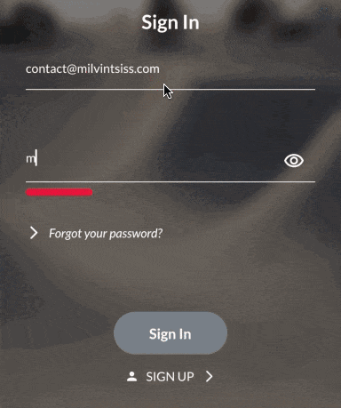

[](https://pub.dev/packages/password_policy)

A simple package that helps you quickly set up a password policy for your application or program!

This package does not contain any UI util but an example use with Flutter is available [here](#flutter).

## Features

### ValidationRules:
You can evaluate the password with a set of rules that you define, the package provides the following
rules: `LengthRule`, `UpperCaseRule`, `LowerCaseRule`, `NoSpaceRule`, `DigitRule`, `SpecialCharacterRule`.
You can also [implement your own rules](#custom-rule).

You can set certain rules to mandatory so the password will not be validated if thoses rules are not respected,
by default all rules provided by the package are mandatory, but this can be set to false.

### Password score and strength:
Depending of your rules and your password the package will give you a password `score` and `strength`.

* The `score` depends on how your password fits to your rules, it will be between `0.0` and `1.0`
  (`1.0` for a password that fits all of your rules).

* The `strength` will be either `weak`, `intermediate`, `good`, `strong` or `unbreakable`. The `strength` fits the
  `score` of your password.

The password policy can be adjusted to ask for a `minimumScore` to validate the password, if the `score` is not
greater or equal to the minimum score, the password will be refused. By default this is set to `1.0`, meaning
that the password have to follow all rules.

## Getting started

Add `password_policy` to your pubspec:
```
dart pub add password_policy
```
or
```
flutter pub add password_policy
```

Import `password_policy` in your file where you want to use it:
```dart
import 'package:password_policy/password_policy.dart';
```

## Usage

### Create our PasswordPolicy
```dart
PasswordPolicy passwordPolicy = PasswordPolicy(
  password: "MyPassword",

  // minimum score inferior to 1.0, this mean the password does not have to
  // match all rules to be valid, except if all rules are mandatory.
  minimumScore: 0.8,

  validationRules: [
    // ask for a password with a minimal length of 10
    LengthRule(minimalLength: 10),

    // ask to use at least 3 upper case characters
    UpperCaseRule(minimumUpperCaseCharacters: 3),

    // ask to use digits but the rule is set as not mandatory so if the password
    // do not satisfy this rule but have a sufficient overall score it will be
    // valid.
    DigitRule(minimumNbDigits: 3, isMandatory: false),

    // ask to not use spaces (including tabs, newlines, etc)
    NoSpaceRule(),

    // Our custom rule defined below
    Contain1026Rule(),
  ],
);
```

### Testing if password comply to our PasswordPolicy
```dart
PasswordCheck passwordCheck = PasswordCheck(password: "Password", passwordPolicy: passwordPolicy);

print("Password score: ${passwordCheck.score}");
print("Password strength: ${passwordCheck.strength.name}");
if (passwordCheck.isValid)
  print("Congrats! Your password is secure!");
else {
  print("You password does not apply to our PassordPolicy, please review the following rules: ");
  passwordCheck.notRespectedMandatoryRules.forEach((rule) => print(rule.name));
}
```

### Custom rule

Here we create a rule that checks if the password contains the string "1026"
If the password does not contain the string it will be invalidated by this
rule.

```dart
class Contain1026Rule extends ValidationRule {
  Contain1026Rule()
          : super(
    impact: 1,
    mandatory: true,
    name: "Milvintsiss",
  );

  @override
  double computeRuleScore(String password) {
    if (password.contains("1026")) return 1.0;

    return 0.0;
  }
}
```

You can also look at the code of the provided rules to see how they are implemented :)

## Additional information

If you find any issue related to this package or have a feature request, please open an
issue [here](https://github.com/Milvintsiss/password_policy/issues) or a pull request
[here](https://github.com/Milvintsiss/password_policy/pulls) if you already resolved the issue.

If you think other rules that are not provided here will be useful for everyone, please open an
issue or PR.

#### Flutter
Currently the package does not provide any UI components, this will be done in a
future in another package that will use this one, you're free to start the work or ask me
for help to use this package in a flutter project!

##### Lazy example with password validation and strength indicator:


##### A simple example will be to use PasswordPolicy for the validator of a `TextFormField`
```dart
PasswordPolicy passwordPolicy = PasswordPolicy(
  minimumScore: 0.8,
  validationRules: [
    LengthRule(minimalLength: 8, name: "Your password should be at least 8 characters long!"),
    UpperCaseRule(name: "Your password should contain one upper case character!"),
    LowerCaseRule(name: "Your password should contain one lower case character!"),
    DigitRule(name: "Your password should contain one digit!"),
    NoSpaceRule(name: "Your password should not contain spaces!"),
    SpecialCharacterRule(isMandatory: false, name: null),
  ],
);

Widget example() {
  return TextFormField(
    validator: (password) {
      if (password == null || password.isEmpty)
        return "This field is mandatory!";
      PasswordCheck passwordCheck =
      PasswordCheck(password: password, passwordPolicy: passwordPolicy);
      if (!passwordCheck.isValid)
        return passwordCheck.notRespectedMandatoryRules
                .map<String?>((rule) => rule.name)
                .join("\n");

      return null;
    },
  );
}
```
